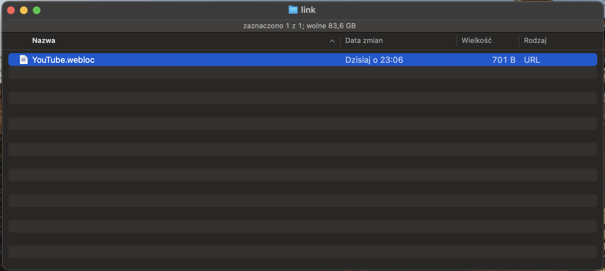
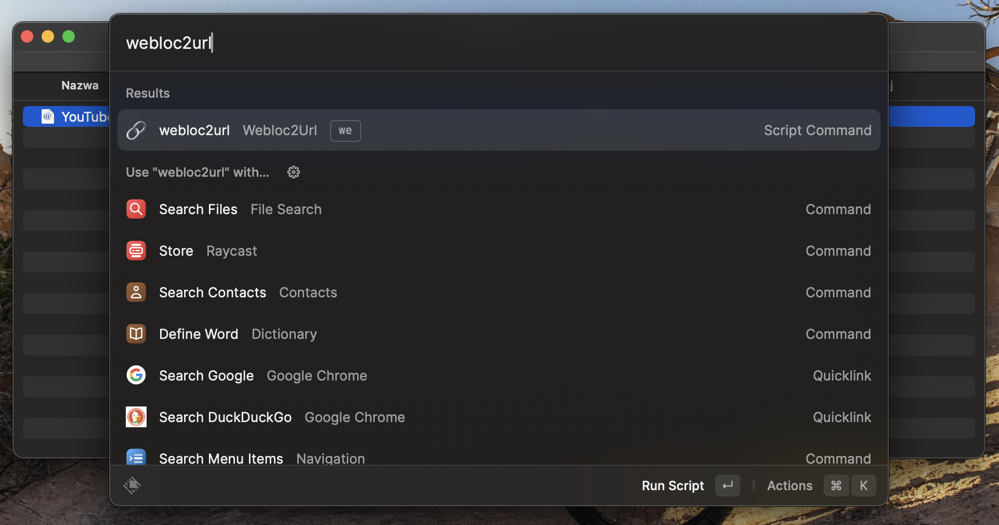
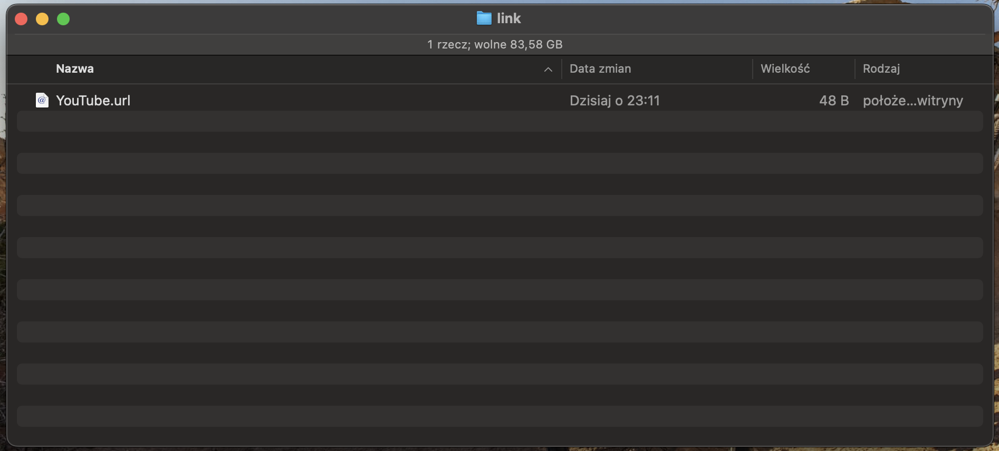
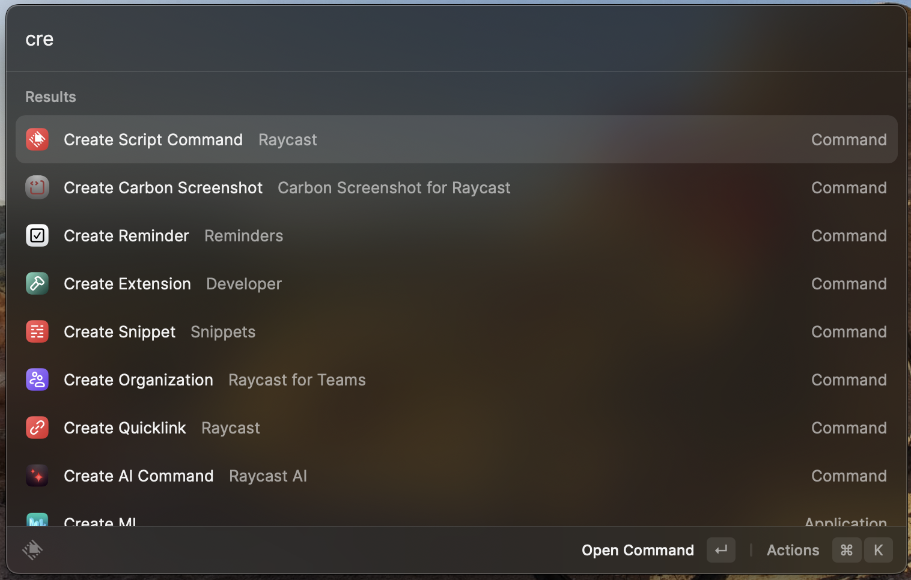
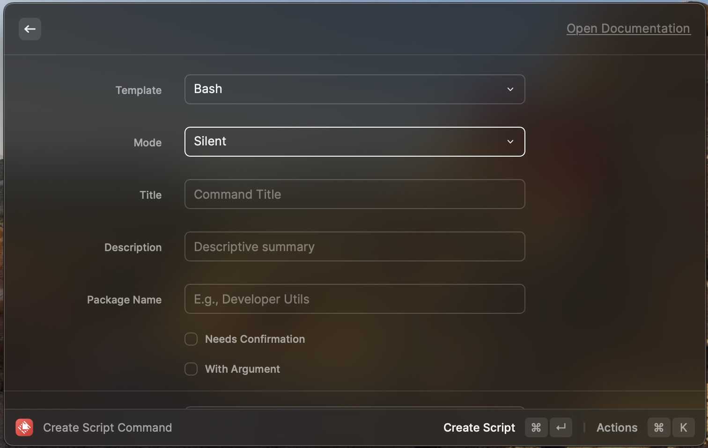
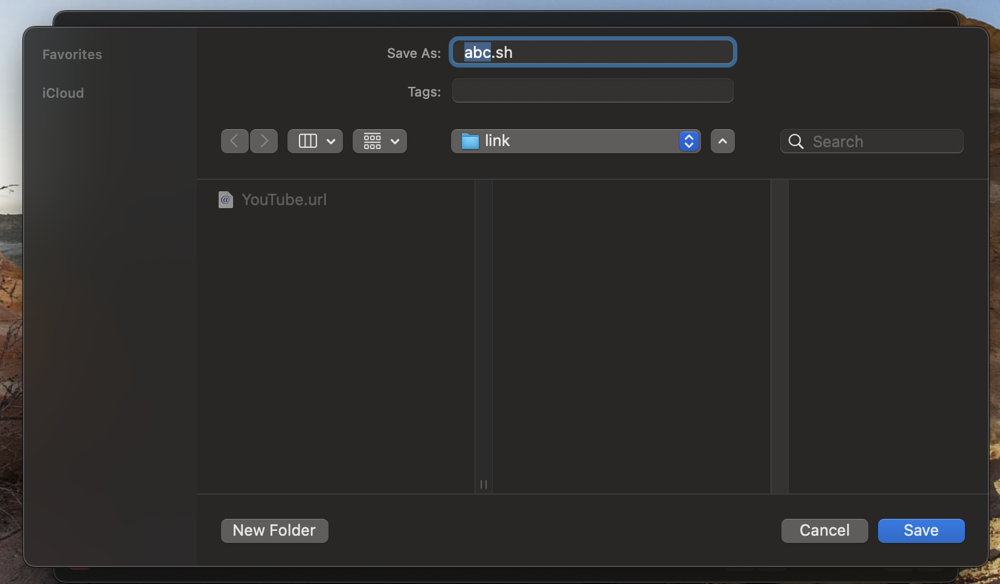

# webloc2url-raycast-script
## Description / backstory

I was frustrated with the way you create webpage link on Mac (why MacOS can't work as other operation systems and use URL???)    Anyway, I've begin serching web, looking for a solution, which eventually led me to the creation of [flagsoft](https://github.com/flagsoft). However, that was not satisfactory for my needs.
## Why I've made this? 🤷🏼‍♂️
Inspired by the way [Raycast Visual Studion extension](https://github.com/raycast/extensions/tree/4978a558a7bf210f3f3e503f5d37beaf3ef9af8c/extensions/open-in-visual-studio-code) works , I've decided to combine this idea with the script, to create an ***ultimate*** solution, which can be executed in current active folder, and run as a user script through Raycast. 

## How should / does it work?
After proper configuration (aka. 'On my machine') it should work like this.

1. You add or have webloc file(s) in a directory

  

2. While you have this directory open in finder and have focus on this window, you open raycast search bar

3. You type 'Your name of script shortcut' (or it's alias) and execute it (press Enter)

  

4. All webloc files *magically* are converted to url (by default oryginal files are deleted in my solution)

  

## Configuration ⚙️
If you would like to have this working on your machine too, here's the instruction on how to do it:
1. Open Raycast, and start typing 'script' to find &nbsp; `Create script command` &nbsp; option

  

2. Open it, and create Bash script, with your custom name, and save it in desired location (it is worth to note, that path to the file, optimally would NOT contain spaces, non english characters and unusual charactrest like '!')

  

  

3. In this directory in which you store your script fork / clone / download / copy paste content of this repo's file to your file
 | `WARNING` | &nbsp; Top comments - those are for Raycast, to properly store logo and name of the file - in the source code I have my own - you can create your own
 | `WARNING` | &nbsp; DO NOT DELETE `#!bin/bash` - it is calling bash to execute the script without it it won't work

At this point you're almost done - to allow execution of script, there might be needed change of privlidges of this file, to allow execution of bash script - one can do it using terminal, and `chmod +x 'name of your file'` command

## Sources

**The oryginal project** &nbsp;&nbsp;&nbsp;&nbsp;&nbsp;&nbsp; https://github.com/flagsoft/webloc2url

**The GUI adaptation of the oryginal** &nbsp;&nbsp;&nbsp;&nbsp;&nbsp;&nbsp; https://github.com/anonymousaga/webloc-to-url-mac-app/

**The inspiration for the way it works**  &nbsp;&nbsp;&nbsp;&nbsp;&nbsp;&nbsp; [Open in Visula Studio](https://github.com/raycast/extensions/tree/4978a558a7bf210f3f3e503f5d37beaf3ef9af8c/extensions/open-in-visual-studio-code)

